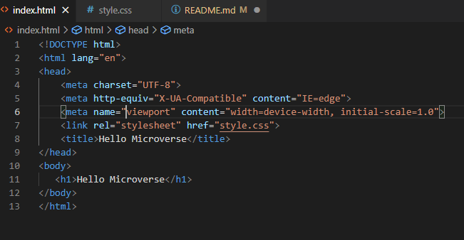

# Hello Microverse

>The goal of this project is to practice what I have learned like GitHub workflow, how to create GitHub branches, commit git changes to an online repository, create a pull request, and request for a code review.



A page that displays Hello Microverse.

## Built With

- HTML
- CSS
- GIT


## Getting Started

To get a local copy of the repository, please run the following commands on your terminal:

```
$ cd <folder>
```

```
$ git clone https://github.com/charlson91/Hello_Microverse_1.git

```
- Open the folder using a code editor. 
- To create a branch , run $git checkout -b <New_branch>
- To change branch, run $git checkout <Branch_name>
### Prerequisites

- Text Editor
- Browser

### Install

- If you want to run the linters... run 'npm install'


### Run tests

- Stylelint -> 'npx stylelint "**/*.{css,scss}"'
- Hint -> 'npx hint .'


## Author

👤 **Ijeogu Kelechi Charles**

- GitHub: [@charlson91](https://github.com/charlson91)
- Twitter: [@ijeogucharlsino](https://twitter.com/ijeogucharlsino)
- LinkedIn: [LinkedIn](https://www.linkedin.com/in/ijeogu-kelechi-charles-8085a7b4/)

## 🤝 Contributing

Contributions, issues, and feature requests are welcome!


## Show your support

Give a ⭐️ if you like this project!

## Acknowledgments

